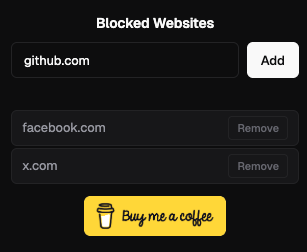

# Lean Site Blocker 🔒

A minimalist bloatless Chrome extension that **instantly closes tabs**
when users try to visit blocked websites.

## Screenshot

## Installation

Install from the Chrome Web Store:
[Lean Site Blocker](https://chromewebstore.google.com/detail/mcgbmeofmblfiopcjphcbcjamdbipdcn?utm_source=item-share-cb)

## Local Development

1. Clone the repository or download the latest release
2. Go to `chrome://extensions`
3. Enable **Developer mode**
4. Click **”Load unpacked”**
5. Select the folder containing this project

## Usage

1. Click the extension icon in your browser toolbar
2. The current tab's domain is pre-filled — or type any domain like `youtube.com`
3. Press **Add** or hit **Enter**
4. Try to visit the site — the tab will **instantly close**

To remove a domain, click **Remove** next to it in the popup.

## How It Works

- Listens to tab updates via `chrome.tabs.onUpdated`
- If the URL matches a blocked domain (including subdomains), the tab is automatically closed
- All data is stored locally via `chrome.storage.local` — nothing leaves your device

---

☕ If you find this useful, [buy me a coffee](https://buymeacoffee.com/mxmhcep99p)
